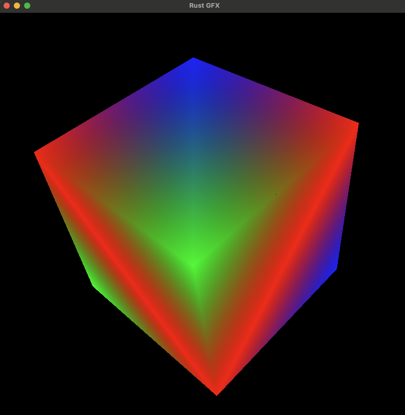

# rusterizer
A simple 3D rasterizer written in Rust. This is a 100% software 3d rasterizer that runs on the CPU and draws directly to the frame buffer (i.e. it does not use a graphics library or GPU). 
A graphics library utilising the GPU is, of course, a far superior option for any real use case so consider this as purely a learning exercise. 



## Getting Started
To build and run:
```
cargo run --release
```
To run the unit tests:
```
cargo test
```
To run the benchmarks:
```
cargo bench
```

## License
This project is licensed under the MIT License - see the LICENSE.md file for details

## Acknowledgments
* [scratchapixel](https://www.scratchapixel.com/)